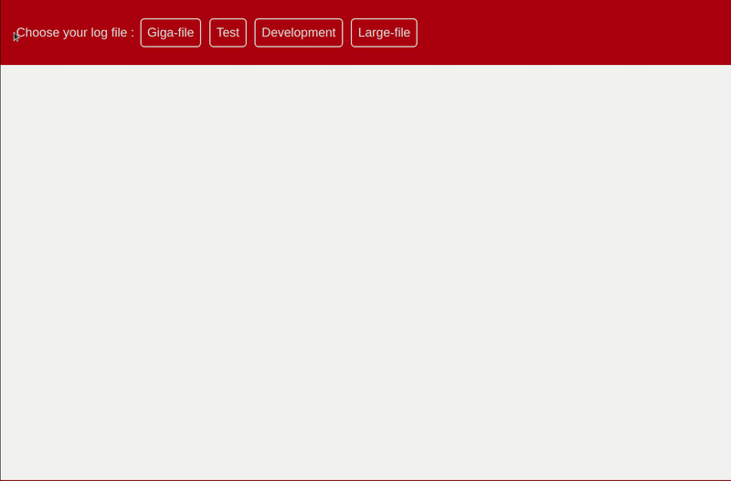
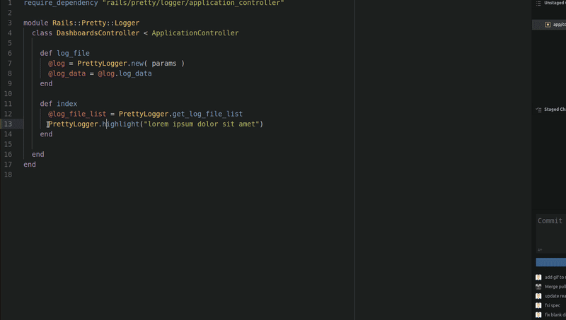
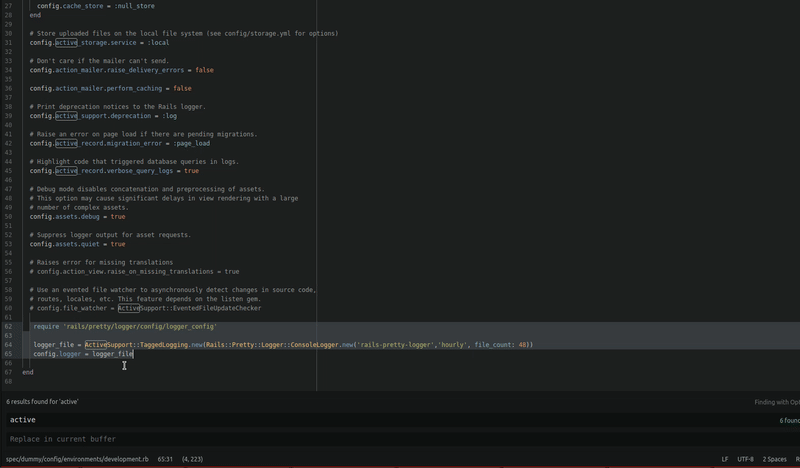

# Rails::Pretty::Logger
Pretty Logger is a logging framework which can be checked from webpage, and also you can also debug easily with highlight method. You can also override logger class with Pretty logger so you can keep hourly logs, which can be limited as you wish.

## Usage
visit http://your-webpage/rails-pretty-logger/dashboards/ then choose your environment, which you want to check and also you can set date range for narrowing down  your logs.


#### How to use debug Highlighter

```
PrettyLogger.highlight("lorem ipsum")
```


#### Use Hourly Log Rotation

Add these lines below to environment config file which you want to override its logger, first argument for name of the log file, second argument for keeping hourly logs, file count for limiting the logs files.

Rails::Pretty::Logger::ConsoleLogger.new("rails-pretty-logger", "hourly", file_count: 48)

```  
#/config/environments/development.rb

require "rails/pretty/logger/config/logger_config"

logger_file = ActiveSupport::TaggedLogging.new(Rails::Pretty::Logger::ConsoleLogger.new("rails-pretty-logger", "hourly", file_count: 48))
config.logger = logger_file
```   


## Installation
Add this line to your application's Gemfile:

```
gem 'rails-pretty-logger'
```

And then execute:
```bash
$ bundle
```

Or install it yourself as:
```bash
$ gem install rails-pretty-logger
```
Mount the engine in your config/routes.rb:

```
mount Rails::Pretty::Logger::Engine => "/rails-pretty-logger"
```


## Contributing

1. [Fork][fork] the [official repository][repo].
2. [Create a topic branch.][branch]
3. Implement your feature or bug fix.
4. Add, commit, and push your changes.
5. [Submit a pull request.][pr]

## License
The gem is available as open source under the terms of the [MIT License](https://opensource.org/licenses/MIT).


[repo]: https://github.com/kekik/rails-pretty-logger/tree/master
[fork]: https://help.github.com/articles/fork-a-repo/
[branch]: https://help.github.com/articles/creating-and-deleting-branches-within-your-repository/
[pr]: https://help.github.com/articles/using-pull-requests/
