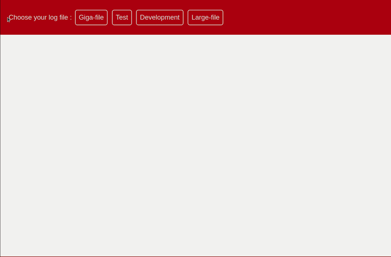
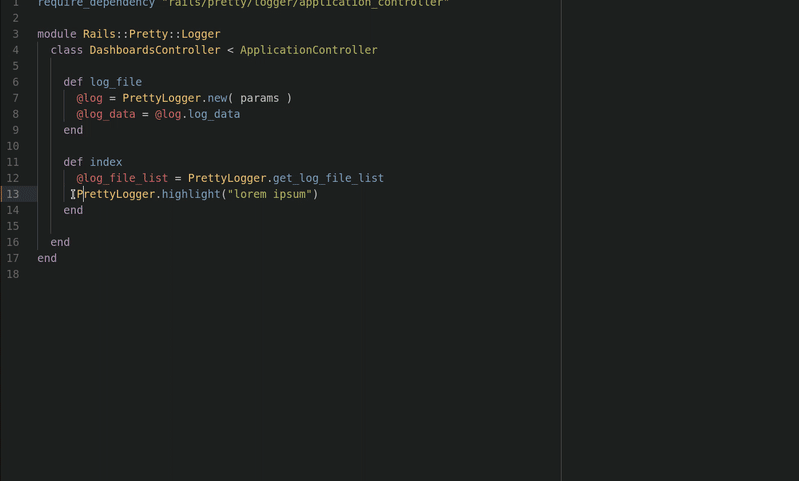
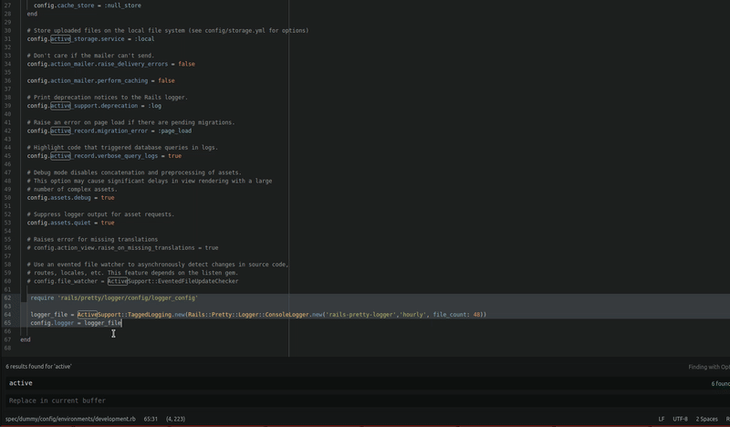

# Rails::Pretty::Logger

Pretty Logger is a Rails engine for checking application logs from a mounted dashboard. It supports Rails 7.1+ and Rails 8, highlighted log entries, clearing log files, and optional hourly log rotation.

## Compatibility

| Gem version | Ruby | Rails | Notes |
| --- | --- | --- | --- |
| `0.3.x` | `>= 3.1` | `>= 7.1`, `< 9.0` | Current line. CI runs Rails 7.1, 8.0, and 8.1 with Ruby 3.3. |
| `0.2.8` | `>= 2.2.2` | `>= 5.0`, `<= 6.1.4.1` | Legacy line for older Rails apps. Pin this version if you still need Rails 5 or Rails 6.1 support. |

## Usage

Visit `http://your-webpage/rails-pretty-logger/dashboards/`, choose a log file, and filter entries by date range. The dashboard can also clear selected log files.



#### How to use debug highlighter

```ruby
Rails::Pretty::Logger::PrettyLogger.highlight("lorem ipsum")
```



#### Use Hourly Log Rotation

Add these lines to the environment config where you want to override the Rails logger. The first argument is the log file name, the second argument enables hourly rotation, and `file_count` limits how many hourly files are kept.

Rails::Pretty::Logger::ConsoleLogger.new("rails-pretty-logger", "hourly", file_count: 48)

```ruby
# config/environments/development.rb

require "rails/pretty/logger/console_logger"

logger_file = ActiveSupport::TaggedLogging.new(Rails::Pretty::Logger::ConsoleLogger.new("rails-pretty-logger", "hourly", file_count: 48))
config.logger = logger_file
```



#### Split your old logs by hourly

If you want to split old log files into hourly files, use the rake task below.

The first argument is the new file prefix and the second argument is the full path of the log file to split.

For bash:

```bash
bin/rails 'split_log[new_log_file_name,/path/to/your/log.file]'
```

For zsh:

```zsh
noglob bin/rails split_log[new_log_file_name,/path/to/your/log.file]
```

## Installation
Add this line to your application's Gemfile:

```
gem "rails-pretty-logger"
```

For Rails 5 or Rails 6.1 applications, pin the legacy version:

```ruby
gem "rails-pretty-logger", "0.2.8"
```

And then execute:
```bash
$ bundle
```

Or install it yourself as:
```bash
$ gem install rails-pretty-logger
```

Run the install generator:

```bash
bin/rails generate rails_pretty_logger:install
```

The generator creates `config/initializers/rails_pretty_logger.rb` and mounts the engine in `config/routes.rb`.

You can also mount the engine manually:

```
mount Rails::Pretty::Logger::Engine => "/rails-pretty-logger"
```

### Protecting the dashboard

Rails Pretty Logger does not provide its own authentication system. The dashboard can read and clear log files, so do not expose it publicly in production.

For local-only use, mount it only in development:

```ruby
# config/routes.rb
mount Rails::Pretty::Logger::Engine => "/rails-pretty-logger" if Rails.env.development?
```

For production use, protect it with whatever authentication or authorization your app already uses. If you prefer to keep the mount simple, configure a hook that runs before every engine action:

```ruby
# config/initializers/rails_pretty_logger.rb
Rails::Pretty::Logger.configure do |config|
  config.authenticate_with = -> { authenticate_user! }
end
```

The hook is evaluated inside the engine controller, so controller helpers such as `authenticate_user!`, `current_user`, `head`, and `redirect_to` are available when your application defines them.

### Configuration

Rails Pretty Logger can be configured from an initializer:

```ruby
# config/initializers/rails_pretty_logger.rb
Rails::Pretty::Logger.configure do |config|
  config.authenticate_with = -> { authenticate_user! }
  config.read_only = Rails.env.production?
  config.max_file_size = 50.megabytes
end
```

`read_only` hides clear buttons and returns `403 Forbidden` from clear endpoints. `max_file_size` is optional; when set, files larger than the limit return `413 Payload Too Large` instead of being read through the dashboard.

## Contributing

This project uses a Nix flake and direnv for local development:

```bash
direnv allow
bundle install
bundle exec rails test
bundle exec ruby -Itest test/system/rails_pretty_logger_interaction_test.rb
```

CI runs the same test suite against Rails 7.1, 8.0, and 8.1 before PRs and pushes to `main` or `master`.

1. [Fork][fork] the [official repository][repo].
2. [Create a topic branch.][branch]
3. Implement your feature or bug fix.
4. Add, commit, and push your changes.
5. [Submit a pull request.][pr]

## License
The gem is available as open source under the terms of the [MIT License](https://opensource.org/licenses/MIT).


[repo]: https://github.com/MehmetCelik4/rails-pretty-logger/tree/master
[fork]: https://help.github.com/articles/fork-a-repo/
[branch]: https://help.github.com/articles/creating-and-deleting-branches-within-your-repository/
[pr]: https://help.github.com/articles/using-pull-requests/
