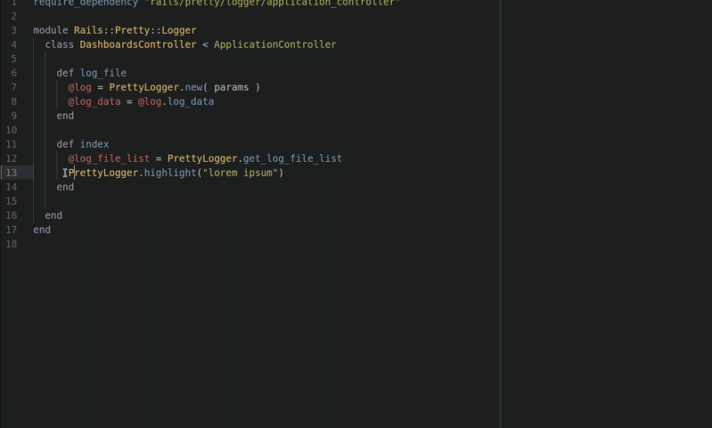

# Rails::PrettyLogger

PrettyLogger is a mountable Rails engine that helps checking logs
from a Ruby on Rails application easier. It supports highlighting a
string of your choosing to easily spot what you seek. It is also possible
to perform hourly log rotation.

## Installation

Add this line to your application's Gemfile:

```ruby
gem 'rails-pretty_logger'
```

And then execute:

    $ bundle install

Or install it yourself as:

    $ gem install rails-pretty_logger

## Usage

Mount `Rails::PrettyLogger::Engine` to the path of your choosing inside `config/routes.rb` of your application.
```
  # For example, to make the dashboard accessible at
  # the path `/rails/pretty_logger/dashboards
  mount Rails::PrettyLogger::Engine => '/rails/pretty_logger'
```

visit http://your-webpage/rails-pretty_logger/dashboards/ then choose your log file, search with date range.


#### How to use debug Highlighter

```
PrettyLogger.highlight("lorem ipsum")
```


#### Use Hourly Log Rotation

Add these lines below to environment config file which you want to override its logger, first argument for name of the log file, second argument for keeping hourly logs, file count for limiting the logs files.

Rails::PrettyLogger::ConsoleLogger.new("rails-pretty_logger", "hourly", file_count: 48)

```
#/config/environments/development.rb

logger_file = ActiveSupport::TaggedLogging.new(Rails::PrettyLogger::ConsoleLogger.new("rails-pretty_logger", "hourly", file_count: 48))
config.logger = logger_file
```


#### Split your old logs by hourly

If you want split your old log files by hourly you can use this rake task below at terminal

argument takes what will be new files names start with, and with the second one will take the full path of your log file which will be splitted

for bash usage ```rake app:split_log["new_log_file_name","/path/to/your/log.file"]```

for zsh usage  ```noglob rake app:split_log["new_log_file_name","/path/to/your/log.file"]```

## Development
After checking out the repo, run `bundler install` to install dependencies. Then, run `rake spec` to run the tests.
You can start the PrettyLogger alongside the dummy application for development with `rails server`.
You can also read [Rails Engines](https://guides.rubyonrails.org/engines.html) if you are not familiar to better understand the gem.

## Contributing

Bug reports and pull requests are welcome on GitHub at https://github.com/kekik/rails-pretty_logger. This project is intended to be a safe, welcoming space for collaboration, and contributors are expected to adhere to the [code of conduct](https://github.com/kekik/rails-pretty_logger/blob/master/CODE_OF_CONDUCT.md).

## License

The gem is available as open source under the terms of the [MIT License](https://github.com/kekik/rails-pretty_logger/blob/master/LICENSE.txt).

## Code of Conduct

Everyone interacting in the Rails::PrettyLogger project's codebases, issue trackers, chat rooms and mailing lists is expected to follow the [code of conduct](https://github.com/kekik/rails-pretty_logger/blob/master/CODE_OF_CONDUCT.md).
